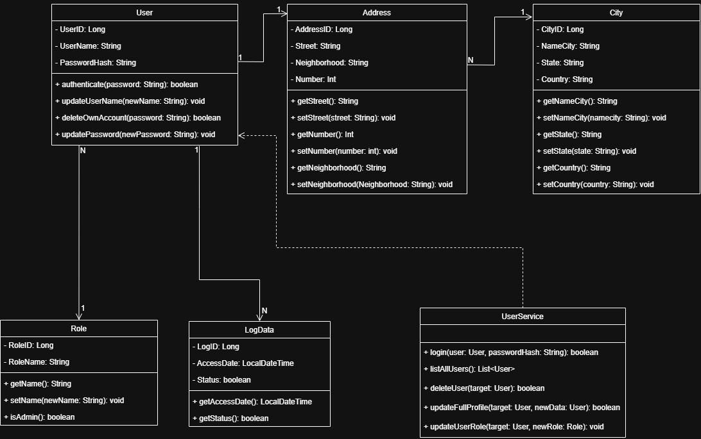
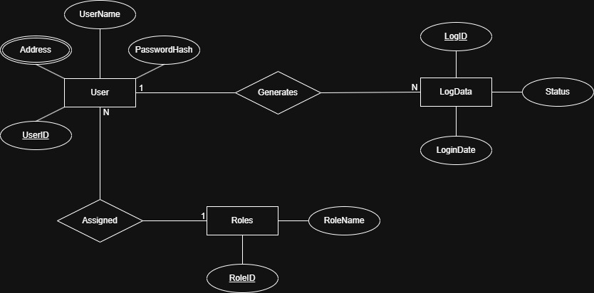
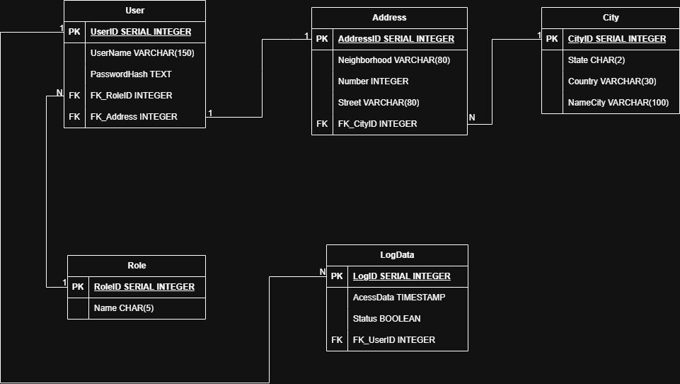

<p align="center">
  
</p>

# 🔐 AuthSystem-Java-OOP

> A Java-based authentication system developed to master OOP principles, layered architecture, and secure user management logic.

---

## 📚 Summary

- 📌 [About the project](#-about-the-project)
- 📊 [Architecture & Design](#-architecture--design)
- ⚙️ [Features](#️-features)
- 🧰 [Technologies used](#-technologies-used)
- 📁 [Project structure](#-project-structure)
- 🧪 [How to run the project](#-how-to-run-the-project)
- ⚙️ [How the system works](#️-how-the-system-works)
- 📊 [Project status](#-project-status)
- 📜 [License](#-license)
- 👤 [Author](#-author)

---

## 📌 About the project

This repository contains a CLI Backend authentication system built with **Java**. The main goal is to demonstrate professional software engineering practices, specifically focusing on **Layered Architecture** and **Object-Oriented Programming (OOP)** .

The project covers the entire flow from user entity definition to business logic and secure credential handling using modern hashing standards like Argon2.

## 📊 Architecture & Design

To ensure a scalable and organized system, the project was planned using UML and Database Modeling. This visual representation helps to understand how the entities, services, and data structures interact within the layered architecture.

## 🗄️ Database Modeling

The persistence layer was planned through two main stages to ensure data integrity and normalization:

### Conceptual Model (DER)

The **Entity-Relationship Diagram** shows the high-level entities and how they relate to each other.


### Logical Model

Detailed representation of tables, foreign keys, and data types specifically designed for **PostgreSQL**.


> 💡 *The Class Diagram is displayed at the top of this README as the project's technical banner.*

## ⚙️ Features

- 🚧 **User Authentication**: Secure login logic with password verification.
- 🚧 **Role-Based Access Control (RBAC)**: Differentiation between standard Users and Administrators.
- 🚧 **Profile Management**: Methods for users to update their own names and passwords.
- 🚧 **Self-Service Account Deletion**: Users can safely delete their own accounts.
- 🚧 **Admin Tools**: Advanced management features like deleting users and updating roles.
- 🚧 **Secure Hashing**: Argon2 implementation with Salt/Pepper (Planned).

## 🧰 Technologies used

- **Java**: Core language for development.
- **PostgreSQL**: Database for persistence.
- **Docker**: For automated environment setup (Planned).
- **Git**: For version control and documentation.

## 📁 Project structure

The project follows a **Layered Architecture** to ensure a clean separation of concerns and maintainability. The structure is organized according to standard Java conventions:

```
AuthSystem-Java-OOP/
├── src/
│   └── main/
│       ├── java/
│       │   └── com/auth/
│       │       ├── controller/    # Entry points for user interaction and terminal input
│       │       ├── model/         # Data entities (User, Role, Address, City, LogData)
│       │       ├── repository/    # Abstraction layer for database communication
│       │       └── service/       # Business logic (Authentication, RBAC, Validation)
│       └── resources/             # Configuration files and external properties
│           └── application.properties.example
├── docs/                          # Project documentation and architectural diagrams
│   ├── class-diagram.png 
│   ├── der-diagram.png
│   └── logical-diagram.png
├── .gitignore                     # Rules for ignored files (e.g., bin/, .vscode/)
├── LICENSE
└── README.md
```

## 🧪 How to run the project

To run this project, you will need the **Java JDK 17+** installed.


1. **Clone the repository**:

    -  git clone [https://github.com/LuizEduardoMarchi/AuthSystem-Java-OOP.git](https://github.com/LuizEduardoMarchi/AuthSystem-Java-OOP.git)

2. **Environment Configuration**: 

    - Rename src/main/resources/application.properties.example to application.properties.
    - Define your unique AUTH_PEPPER and database credentials inside the file.

3. **Database**:

    - Initialize your PostgreSQL instance and run the schema.sql script.

4. **Execution**:

    - Run the Main class through your IDE (VS Code recommended). 

## ⚙️ How the system works
The system is organized into four main layers:

- Model: Defines the objects (User, Role, Address, City, LogData) and their attributes .  

- Service: Contains the business rules, such as login validation and updateUserRole logic .  

- Repository: Responsibility for communicating with the PostgreSQL database.

- Controller: Responsibility for handling terminal input and user interface.

## 📊 Project status
- 🚧 In Development

## 📜 License
- This project is licensed under the MIT License.

## 👤 Author
- Luiz Eduardo Marchi — Software Engineering Student